# TechSolutions IPS — Architecture Diagrams

> Mermaid diagrams describing the system architecture, data flow, and key processes.
> View these on GitHub or in any Markdown renderer with Mermaid support (VS Code with Mermaid extension, etc.).

---

## 1. System Architecture (Layered Overview)

```mermaid
graph TB
    subgraph Clients
        Browser["🌐 Browser<br/>(Razor Views + jQuery AJAX)"]
        API["📱 External API Client<br/>(JWT Bearer)"]
    end

    subgraph Middleware Pipeline
        HTTPS["HTTPS Redirection"]
        Routing["Routing"]
        CORS["CORS Policy"]
        AuthN["Authentication<br/>(Cookie + JWT)"]
        AuthZ["Authorisation<br/>(Roles + Policies)"]
    end

    subgraph Controllers
        Home["HomeController"]
        Cust["CustomerController"]
        AdminDash["AdminDashboardController"]
        EmployeeDash["EmployeeDashboardController"]
        AdminEmployees["AdminEmployeesController"]
        TokenAPI["Api/TokenController"]
        NotifAPI["Api/NotificationsController"]
    end

    subgraph Services
        CustSvc["CustomerService"]
        CustAccessSvc["CustomerAccessService"]
        CustRefSvc["CustomerReferenceDataService"]
        DashSvc["AdminDashboardService"]
        EmployeeDashSvc["EmployeeDashboardService"]
        AdminNotifSvc["AdminNotificationService"]
        AuditSvc["AuditService"]
        SignInMgr["AppSignInManagerService"]
        RSA["RsaCryptoService"]
        EmailQ["EmailQueue"]
        EmailDisp["EmailDispatcherService<br/>(BackgroundService)"]
        SmtpSend["SmtpEmailSender"]
        Notifier["UserRegistrationNotifier"]
    end

    subgraph Repositories
        CustRepo["CustomerRepository"]
        AuditRepo["AuditRepository"]
        NotifRepo["AdminNotificationRepository"]
        EmailRepo["EmailQueueRepository"]
        CountryRepo["CountryDialCodeRepository"]
    end

    subgraph Data
        DbCtx["ApplicationDbContext<br/>(EF Core)"]
        Identity["ASP.NET Core Identity"]
    end

    DB[("SQL Server<br/>(SQLEXPRESS)")]

    Browser --> HTTPS --> Routing --> CORS --> AuthN --> AuthZ
    API --> HTTPS

    AuthZ --> Home
    AuthZ --> Cust
    AuthZ --> AdminDash
    AuthZ --> EmployeeDash
    AuthZ --> AdminEmployees
    AuthZ --> TokenAPI
    AuthZ --> NotifAPI

    Cust --> CustSvc
    Cust --> CustAccessSvc
    Cust --> CustRefSvc
    Cust --> AuditSvc

    AdminDash --> DashSvc
    EmployeeDash --> EmployeeDashSvc
    AdminEmployees --> AdminNotifSvc
    AdminEmployees --> AuditSvc
    NotifAPI --> AdminNotifSvc
    TokenAPI --> SignInMgr
    TokenAPI --> RSA

    DashSvc --> CustRepo
    DashSvc --> Identity
    EmployeeDashSvc --> CustRepo
    EmployeeDashSvc --> AuditRepo
    CustSvc --> CustRepo
    CustSvc --> AuditRepo
    CustAccessSvc --> AuditRepo
    CustRefSvc --> CountryRepo
    AdminNotifSvc --> NotifRepo
    AdminNotifSvc --> Identity

    AuditSvc --> AuditRepo
    Notifier --> NotifRepo
    Notifier --> EmailQ
    EmailQ --> EmailRepo
    EmailDisp --> EmailRepo
    EmailDisp --> SmtpSend

    CustRepo --> DbCtx
    AuditRepo --> DbCtx
    NotifRepo --> DbCtx
    EmailRepo --> DbCtx
    CountryRepo --> DbCtx
    Identity --> DbCtx

    DbCtx --> DB
    SmtpSend --> SMTP["📧 SMTP Server"]
```

---

## 2. User Registration & Approval Flow

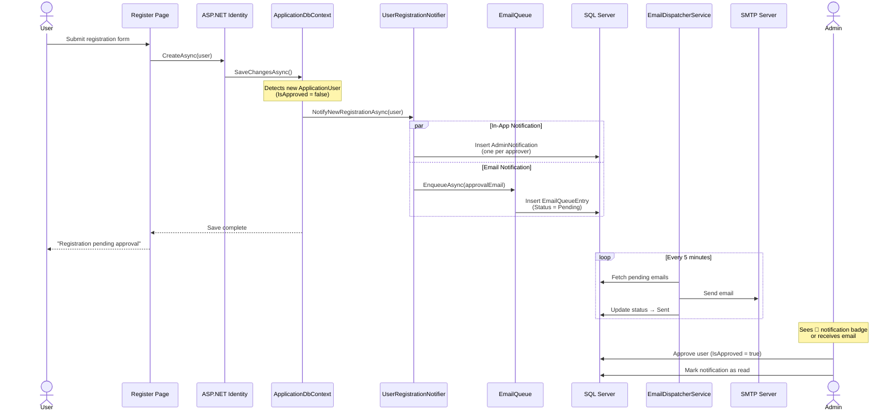

---

## 3. User Login Flow (with Lockout Protection)

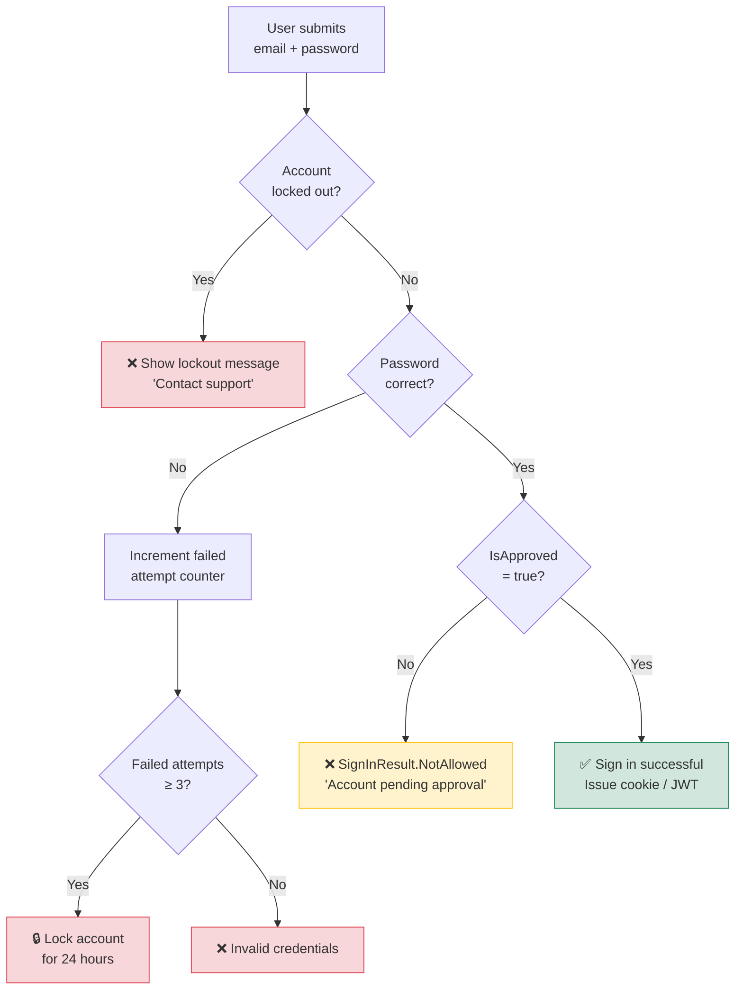

---

## 4. Customer CRUD Workflow

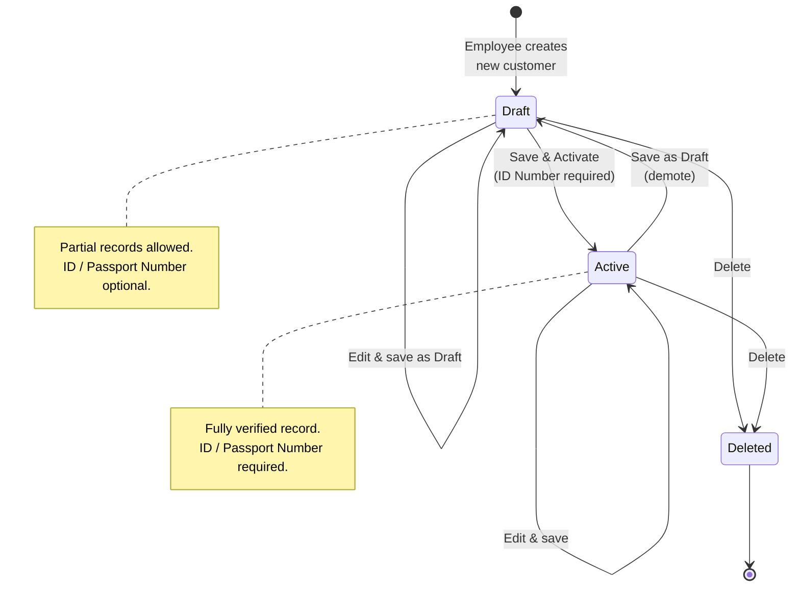

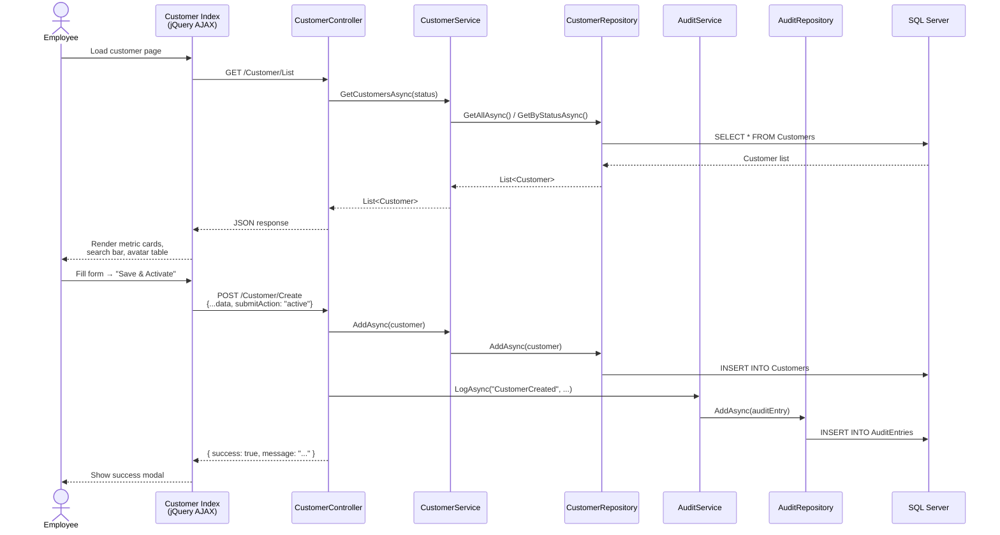

---

## 5. Email Queue & Background Dispatch

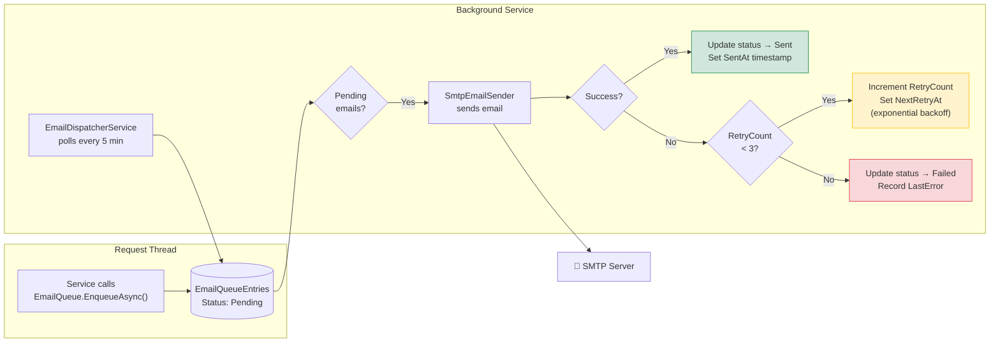

---

## 6. Dependency Injection Registration

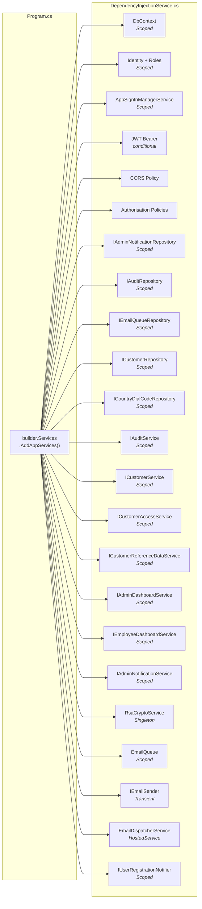

---

## 7. Entity Relationship Diagram

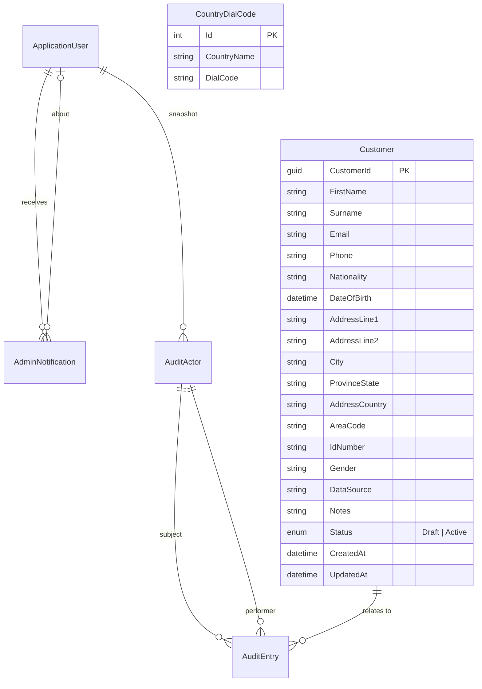

---

## 8. Middleware Pipeline

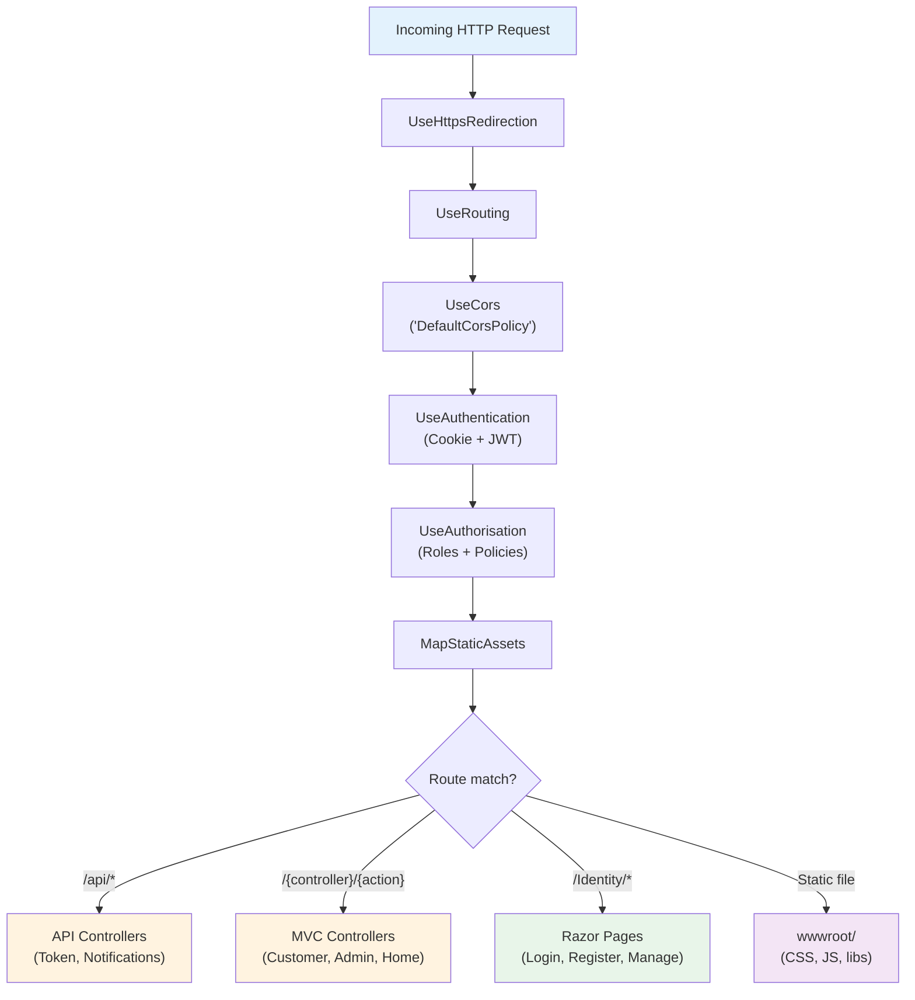

---

## 9. ApplicationUser Enhancements

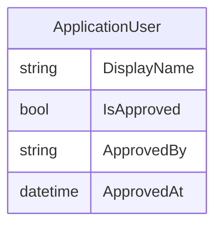

**Note:** The `ApplicationUser` entity includes custom fields for user display names and approval tracking. These fields are critical for the user approval workflow.

---

## 10. Role-Based Navigation Visibility

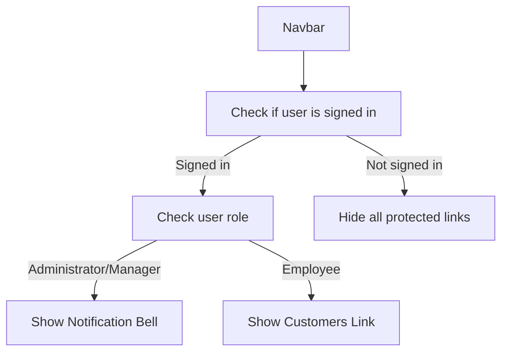

**Note:** Navigation links are dynamically rendered based on the user's authentication state and role.

---

## 11. Notification Bell Modal Flow

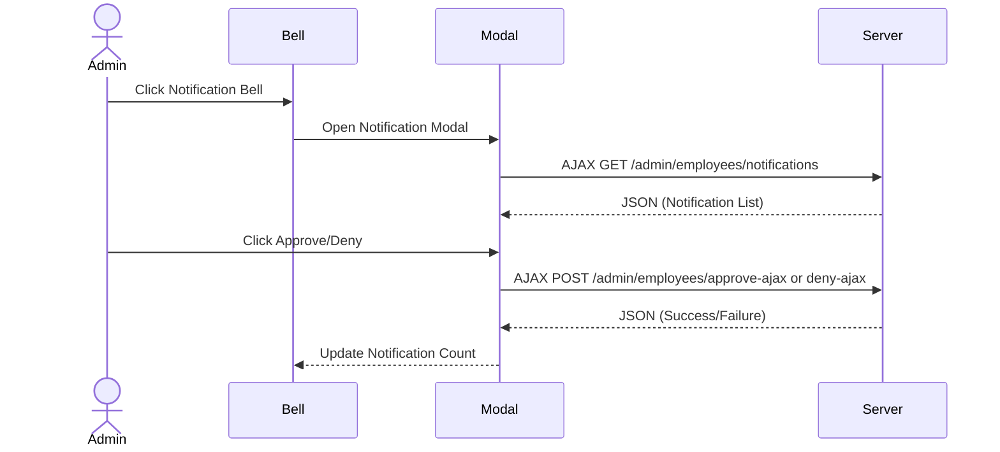

**Note:** The notification bell uses AJAX for instant updates without a full page reload.

---

## 12. CountryDialCode Usage

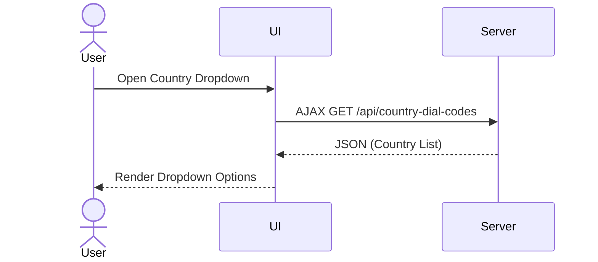

**Note:** The `CountryDialCode` table is used to populate dropdowns dynamically, ensuring consistent data.

---

## 13. DataSeeder Process

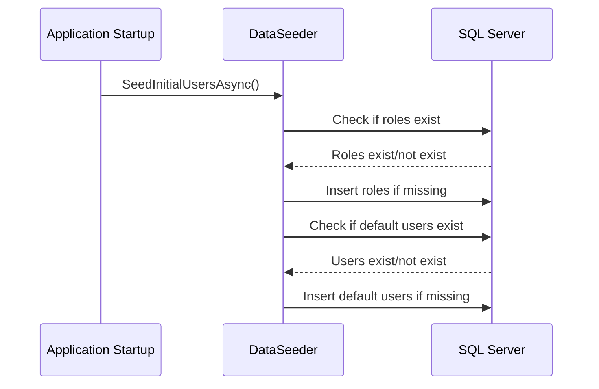

**Note:** The `DataSeeder` ensures roles and default users are created on startup.

---

## 14. JWT/RSA API Login Flow

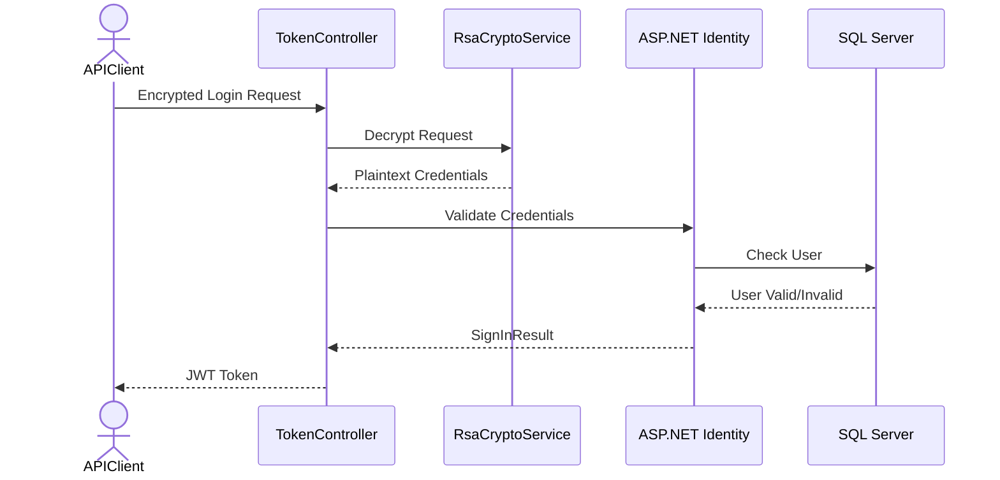

**Note:** The API login flow uses RSA encryption for credentials and issues JWT tokens for stateless authentication.

---

## 15. Audit Logging on Customer Operations

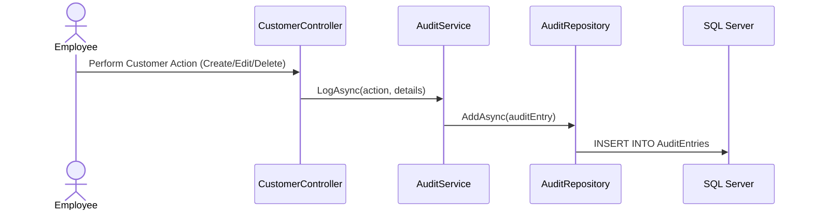

**Note:** All customer operations are logged for auditing purposes.
